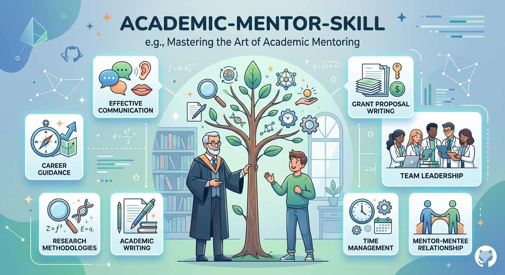
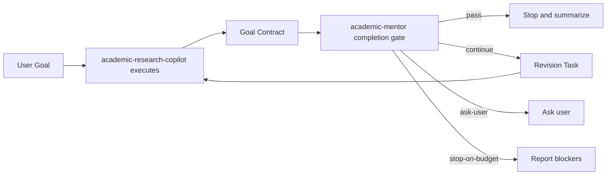

# Academic Mentor Skill Repo

中文 | [English](./README_EN.md)



一个面向博士科研、开题、论文逻辑和答辩准备的导师-助手协作 Skill 系统。

你是否想过：如果世界上顶级的科学家能够成为你的长期导师，会怎样指导你的毕业论文、研究方向和科研训练？

不是简单回答问题，也不是把知识点堆给你；而是在你选题发散时帮你收束，在你方法堆叠时指出真正的问题，在你写开题和论文时追问证据是否站得住，在你准备答辩时提前暴露最危险的漏洞。

这个仓库试图把这种“引路人”做成可运行的 skill 系统：一个助手负责和你一起读论文、整理知识、推进写作和实验；一个导师负责从更高标准审查研究方向、问题定义、证据链和完成质量。两者不是互相附和，而是在“助手执行 + 导师审查 + 未完成则继续”的对抗式闭环中，帮助你把科研任务真正做到可交付。

它不复刻任何真实学者，也不模仿名人口吻；它蒸馏的是公开论文、课程、访谈和项目中体现出的研究判断方式。

## What You Get

- 一个长期科研助手：阅读论文、整理知识、规划实验、沉淀 `Paper Card`、`Idea Card`、`Experiment Card` 和 `Writing Brief`。
- 一个严格学术导师：判断方向是否值得做、问题是否干净、方法是否服务于问题、证据是否支撑 claim。
- 一个多导师协同系统：默认输出一个统一导师声音，内部用 Fei-Fei / Kaiming / Li-Mu 三类视角做交叉审查。
- 一个完成检查机制：任务没达到目标时，导师返回 `continue`，助手只执行下一轮明确修订任务，默认最多 3 轮。
- 一个可扩展 skill 仓库：可以继续增加人物源包、记忆后端、Stop hook adapter 和脚本化 loop harness。

## Quick Demo

假设你给出一个博士开题题目：

```text
面向大范围作物制图的光学遥感时间序列鲁棒建模研究
```

普通助手可能会说：

```text
这个题目很好，可以从数据、模型和实验三个方面展开。
```

`academic-research-copilot` 会先执行：

- 整理研究背景和相关论文
- 抽取作物制图、光学遥感时间序列、缺失观测、跨区域泛化等关键问题
- 生成研究问题、技术路线、实验矩阵和写作 brief
- 形成可交给导师审查的 `Goal Contract`

`academic-mentor` 会进一步审查：

- 这个问题是否足够干净，能不能支撑博士主线？
- 方法是否大于问题，还是确实服务于大范围作物制图？
- Sentinel-2 / GF-2 数据、作物标签、区域迁移和时间缺失实验是否支撑你的 claim？
- 哪些术语或表述在遥感语境下不成立，例如不合适的“对象级转化”？
- 如果还没完成，下一轮助手必须具体修什么？

这就是本仓库的核心工作流：**Copilot 做，Mentor 审，没过就继续，不让任务在看似完成时停掉。**

## How It Works



默认流程：

1. 用户给出研究目标、论文片段、开题任务、实验计划或答辩问题。
2. `academic-research-copilot` 负责执行：读、整理、规划、写、改。
3. `academic-mentor` 负责审查：判断目标是否真正完成。
4. 如果导师返回 `continue`，助手只处理导师指定的阻塞问题，不重新发散。
5. 默认 `max_iterations = 3`，避免无限循环。

## The Three Advisor Lenses

| 内部导师视角 | 不模仿什么 | 实际负责什么 |
| --- | --- | --- |
| `Fei-Fei advisor` | 不模仿语气或个人表达习惯 | 判断研究意义、学术图景、故事线、问题是否值得成为博士主线 |
| `Kaiming advisor` | 不模仿短句风格或个人口吻 | 判断问题是否干净、方法是否必要、复杂度是否超过问题本身 |
| `Li-Mu advisor` | 不模仿课程口头禅 | 拆解学习路径、实验路线、最小可验证闭环和下一步执行任务 |

这些视角来自公开论文、项目页、课程、talk 和访谈的规则蒸馏。它们不是三个角色聊天，而是内部 judgment signals，默认由一个统一导师声音输出。

## Installation

将两个 skill 复制到本地 skills 路径：

```bash
cp -R skills/academic-mentor ~/.codex/skills/
cp -R skills/academic-research-copilot ~/.codex/skills/
```

如果你使用的是其他 agent 框架，只要它支持技能目录加载，也可以直接指向：

- `skills/academic-mentor/`
- `skills/academic-research-copilot/`

## Usage Examples

```text
Use $academic-research-copilot to read these crop-mapping PDFs and create Paper Cards.
```

```text
Use $academic-mentor to judge whether my PhD proposal topic is defensible.
```

```text
Use $academic-research-copilot to revise my experiment plan, then hand it to $academic-mentor for completion gate.
```

```text
Use $academic-mentor in panel mode to stress-test my defense questions.
```

```text
Use both skills to keep improving this opening report until the mentor returns pass or stop-on-budget.
```

## Who This Is For

- 博士生：准备开题报告、论文主线、实验设计、阶段汇报和答辩。
- 科研作者：需要检查 claim-evidence 是否成立，而不只是润色句子。
- 研究方向探索者：需要判断方向该继续、收缩、补证据还是放弃。
- Agent builder：想把“助手执行 + 导师审查 + 有界续跑”做成可复用 skill 协议。

## Design Boundaries

- 这不是对李飞飞、何凯明、李沐本人的模拟，也不声称代表他们的真实意见。
- 这不是自动科研系统；它能审查、拆解和推进任务，但不能替代真实实验、导师反馈和领域验证。
- 这不是无限运行 agent；默认最多 3 轮，超过后必须返回 `stop-on-budget` 和剩余阻塞点。
- 这不是泛用写作润色器；如果问题定义或证据链不成立，导师会先指出根本矛盾。
- 共享记忆协议已经定义，但具体持久化后端取决于宿主 agent 框架。

## Repository Goals

这个仓库解决四件事：

1. 把 `academic-mentor` 和 `academic-research-copilot` 封装成可直接安装、可直接推送 GitHub 的双 skill 仓库。
2. 把导师人格从“模仿名人说话”收束到“基于公开来源提炼研究判断规则”。
3. 将李飞飞、何凯明、李沐三类导师特质转化为可审查、可测试、可切换权重的内部判断机制。
4. 将其升级为“助手执行 + 导师审查 + 有界续跑 + 反馈调权学习”的学术协作系统。

## Source Distillation

当前仓库已经包含三份人物源包：

- `fei-fei-li-source-pack.md`
- `kaiming-he-source-pack.md`
- `li-mu-source-pack.md`

蒸馏材料覆盖：

- 代表论文和项目页
- 官方主页和机构资料
- 高信号公开课程、talk、lecture 和 video
- 能反映稳定研究观的访谈

其中最重要的一层不是“语气模仿”，而是“论文表达蒸馏”：

- 论文如何定义问题
- 论文如何控制贡献边界
- 论文如何组织证据与实验
- 论文如何处理局限、风险与不过度宣称

关键资料：

- `references/paper-first-distillation.md`
- `references/research/fei-fei-li-paper-dna.md`
- `references/research/kaiming-he-paper-dna.md`
- `references/research/li-mu-paper-dna.md`
- `references/research/fei-fei-li-paper-profile-card.md`
- `references/research/kaiming-he-paper-profile-card.md`
- `references/research/li-mu-paper-profile-card.md`
- `references/research/fei-fei-li-representative-paper-anchors.md`
- `references/research/kaiming-he-representative-paper-anchors.md`
- `references/research/li-mu-representative-paper-anchors.md`

更多方法见：

- [docs/source-distillation-and-testing.md](./docs/source-distillation-and-testing.md)
- [examples/mode-switch-prompts.md](./examples/mode-switch-prompts.md)
- [tests/academic-persona-eval.md](./tests/academic-persona-eval.md)

## Academic Focus

重点适用场景：

- 开题题目和研究内容是否成立
- 研究方向是否值得继续
- 论文是否在讲真问题
- 方法是否大于问题
- 实验链条是否足以支撑 claim
- 答辩时哪里最容易被打穿

当前 `paper` 能力拆分为两类：

- `paper-logic`：先判断论文到底有没有在讲真问题、论证是否站得住。
- `paper-strategy`：在方向基本成立的前提下，判断下一步最该怎么改、怎么补实验、怎么收贡献。

## Repository Layout

```text
academic-mentor-skill-repo/
├── README.md
├── README_EN.md
├── docs/
│   ├── skill-review-and-architecture.md
│   ├── source-distillation-and-testing.md
│   ├── persona-interaction-and-switching.md
│   └── adversarial-completion-loop.md
├── examples/
│   └── mode-switch-prompts.md
├── tests/
│   └── academic-persona-eval.md
└── skills/
    ├── academic-mentor/
    │   ├── SKILL.md
    │   ├── agents/openai.yaml
    │   └── references/
    │       ├── advisor-persona.md
    │       ├── mentor-council.md
    │       ├── source-grounding.md
    │       ├── fei-fei-li-source-pack.md
    │       ├── kaiming-he-source-pack.md
    │       ├── li-mu-source-pack.md
    │       ├── paper-first-distillation.md
    │       ├── adversarial-completion-loop.md
    │       ├── completion-gate-rubric.md
    │       ├── shared-memory-schema.md
    │       └── shared-memory-operations.md
    └── academic-research-copilot/
        ├── SKILL.md
        ├── agents/openai.yaml
        └── references/
            ├── copilot-orchestration.md
            ├── adversarial-completion-loop.md
            ├── goal-contract-schema.md
            ├── completion-gate-rubric.md
            ├── loop-trace-schema.md
            ├── shared-memory-schema.md
            └── shared-memory-operations.md
```

## Roadmap

1. 继续按论文、项目页、公开视频、访谈扩充三位导师源包。
2. 增加更多真实学术任务测试：开题、论文、实验计划、答辩、阶段汇报。
3. 增加可选 Claude Code Stop hook adapter，将 `Completion Check.decision = continue` 映射为阻止停止。
4. 增加独立 loop harness，让 copilot -> mentor -> copilot 循环可以脚本化执行。
5. 接入更强的共享记忆后端，使导师能长期学习学生的研究背景、常见问题和反馈偏好。

## Push to GitHub

当前仓库已经本地初始化。检查并提交当前改动后，添加 remote 并 push：

```bash
git status
git add README.md README_EN.md docs examples tests skills
git commit -m "Add adversarial academic mentor-copilot skills"
git remote add origin <your-repo-url>
git push -u origin main
```
