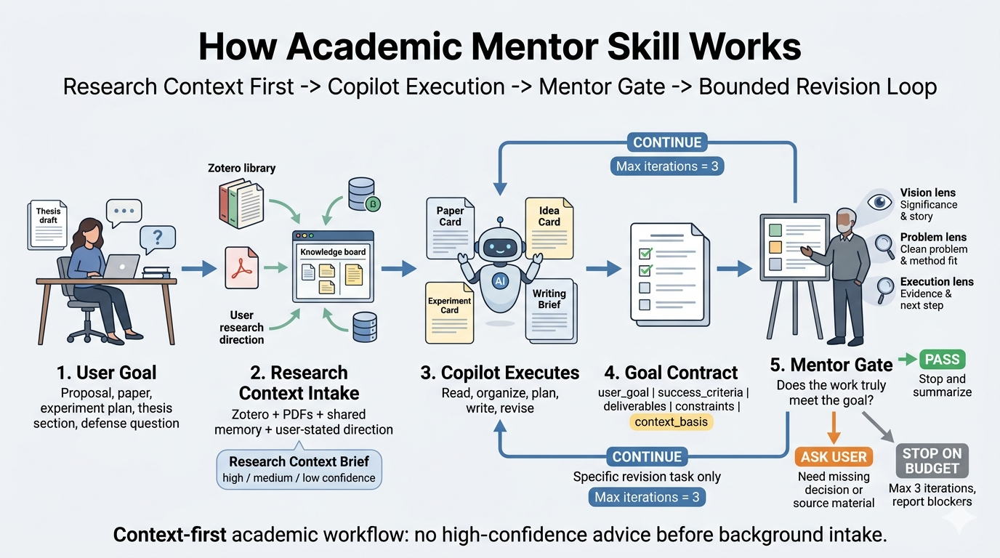

# Academic Mentor Skill Repo

[中文](./README.md) | English


A mentor-copilot skill system for PhD research, proposal defense, paper logic, experiment planning, and bounded academic task completion.

What if some of the world's strongest scientists could become your long-term research mentors, guiding your thesis, your research direction, and the way you learn to do science?

Not just answering questions. Not just giving you more papers to read. A real mentor should narrow a vague direction, challenge a method-heavy but problem-light idea, ask whether your evidence supports your claim, and expose the dangerous weaknesses before a proposal defense or thesis defense does.

This repo turns that idea into an installable skill system. One skill works with you as a research copilot: reading papers, organizing knowledge, planning experiments, and drafting academic writing. The other skill acts as a strict mentor: judging research direction, problem definition, evidence quality, and whether the task is truly complete. They are designed to disagree productively: the copilot executes, the mentor reviews, and the system continues when the user's goal has not been met.

We deeply respect these scholars. This project does not reduce them to cheap role-play. But we also do not want the mentor to feel like a faceless reviewer. It studies research judgment patterns visible in their public papers, courses, interviews, talks, and project pages, and tries to preserve the stable communication style that makes a mentor feel human: how they choose important problems, control contribution boundaries, organize evidence, and turn criticism into usable guidance.

## What You Get

- A long-term research copilot: first build research context from Zotero, PDFs, or the user's stated direction, then read papers, organize knowledge, plan experiments, and maintain `Paper Card`, `Idea Card`, `Experiment Card`, and `Writing Brief` objects.
- A strict academic mentor: judge whether a direction is worth doing, whether the problem is clean, whether the method serves the problem, and whether the evidence supports the claim.
- A multi-advisor internal council: one unified mentor voice by default, internally informed by Fei-Fei / Kaiming / Li-Mu style judgment lenses.
- A completion gate: when the goal is not met, the mentor returns `continue`, and the copilot executes only the next concrete revision task. Default maximum loop count is 3.
- An extensible skill repo: source packs, memory protocols, Stop hook adapters, and standalone loop harnesses can be added over time.

## Who This Is For

- PhD students preparing proposals, thesis chapters, experiments, milestone reports, or defenses.
- Researchers who need strict direction triage rather than generic brainstorming.
- Academic writers who need claim-evidence checking before polishing.
- Agent builders who want a reusable skill-level completion gate before implementing runtime hooks.

## How It Works



Default workflow:

1. The user provides a research goal, paper section, proposal task, experiment plan, or defense issue.
2. `academic-research-copilot` first imports research context: Zotero / PDFs / shared memory when available, or a low-confidence `Research Context Brief` from the user's stated direction.
3. `academic-research-copilot` then executes: read, organize, plan, write, revise.
4. `academic-mentor` reviews whether the goal is truly complete and whether the context basis is sufficient.
5. If the mentor returns `continue`, the copilot only fixes the named blocking issue.
6. Default `max_iterations = 3` to avoid infinite runs.

## Quick Demo

Suppose you give the system a PhD proposal topic:

```text
Robust Optical Remote Sensing Time-Series Modeling for Large-Scale Crop Mapping
```

A generic assistant may say:

```text
This is a good topic. You can develop it from data, models, and experiments.
```

`academic-research-copilot` first executes:

- builds a `Research Context Brief` from Zotero, PDFs, existing memory, or the user's stated research direction
- organizes background and related papers
- extracts key problems such as crop mapping, optical satellite time series, missing observations, and cross-region generalization
- drafts research questions, technical routes, experiment matrices, and writing briefs
- produces a `Goal Contract` with `context_basis` for mentor review

`academic-mentor` then reviews:

- Is the problem clean enough to support a PhD thesis?
- Does the method serve large-scale crop mapping, or is it larger than the problem?
- Do Sentinel-2 / GF-2 data, crop labels, regional transfer, and temporal-missingness experiments support the claims?
- Are any terms wrong for the remote-sensing context, such as an inappropriate object-level transformation?
- If the work is not complete, what exactly must the copilot fix next?

That is the core loop: **Copilot executes. Mentor gates. If the work is not complete, the system continues with a bounded revision task.**

## The Three Advisor Lenses

| Internal advisor lens | Respectful grounding | What it actually does |
| --- | --- | --- |
| `Fei-Fei advisor` | Respectfully learns from public work that emphasizes big questions, significance, and research narrative | Judges research significance, academic framing, narrative coherence, and thesis-worthiness |
| `Kaiming advisor` | Respectfully learns from public papers that pursue clean problems, essential methods, and compact contributions | Judges whether the problem is clean, whether the method is necessary, and whether complexity exceeds the problem |
| `Li-Mu advisor` | Respectfully learns from public courses and technical writing that emphasize clear decomposition, engineering grounding, and teachable execution | Decomposes learning paths, experiment routes, minimal validation loops, and next execution tasks |

These lenses are distilled from public papers, project pages, courses, talks, and interviews. They are not three role-play characters, and they do not speak on behalf of the real people. They are internal judgment signals synthesized into one mentor answer by default.

## Installation

Copy both skills into your local skills directory:

```bash
cp -R skills/academic-mentor ~/.codex/skills/
cp -R skills/academic-research-copilot ~/.codex/skills/
```

If you use another agent framework, point it at:

- `skills/academic-mentor/`
- `skills/academic-research-copilot/`

## Usage Examples

```text
Use $academic-research-copilot to read these crop-mapping PDFs and create Paper Cards.
```

```text
Use $academic-mentor to judge whether my PhD proposal topic is defensible.
```

```text
Use $academic-research-copilot to revise my experiment plan, then hand it to $academic-mentor for completion gate.
```

```text
Use $academic-mentor in panel mode to stress-test my defense questions.
```

```text
Use both skills to keep improving this opening report until the mentor returns pass or stop-on-budget.
```

## Respectful Use And Boundaries

- We deeply respect Fei-Fei Li, Kaiming He, Mu Li, and other scholars. They are used as inspirations because their public academic work shows research taste, communication discipline, and mentoring patterns worth learning from.
- The project learns from the judgment patterns visible in their public academic work. It does not try to speak for them or turn them into performative personas.
- The system is useful for research judgment, background organization, experiment planning, and writing support, but it does not replace real experiments, advisor feedback, or domain validation.
- The default budget is 3 iterations so the system can keep pushing incomplete work without drifting into endless loops.
- When the problem definition or evidence chain is weak, the mentor points to the root contradiction before polishing language.
- The shared memory protocol is defined, but persistent backend integration still depends on the host agent framework.
- High-stakes academic judgment must state `context_basis`; with only a one-line prompt, the system should either give a low-confidence answer or ask for Zotero/PDF/direction material first.

## Repository Goals

This repo does four things:

1. packages `academic-mentor` and `academic-research-copilot` into a dual-skill repo that can be installed or pushed to GitHub directly
2. grounds the mentor in respectful, public-source-derived research judgment rules instead of superficial persona design
3. converts the mentor traits inspired by Fei-Fei Li, Kaiming He, and Mu Li into auditable, testable, internally weighted judgment mechanisms
4. upgrades the system into copilot execution plus mentor review, with bounded continuation and feedback-based weighting

## Source Distillation

The repo already includes three source packs:

- `fei-fei-li-source-pack.md`
- `kaiming-he-source-pack.md`
- `li-mu-source-pack.md`

The distillation uses:

- representative papers and project pages
- official homepages and institutional materials
- high-signal public lectures, talks, and videos
- interviews that reveal durable research values

The most important layer is not speech imitation but paper-expression distillation:

- how papers define the real problem
- how papers control contribution boundaries
- how papers organize evidence and experiments
- how papers handle limitations and avoid overclaim

Key materials:

- `references/paper-first-distillation.md`
- `references/research/fei-fei-li-paper-dna.md`
- `references/research/kaiming-he-paper-dna.md`
- `references/research/li-mu-paper-dna.md`
- `references/research/fei-fei-li-paper-profile-card.md`
- `references/research/kaiming-he-paper-profile-card.md`
- `references/research/li-mu-paper-profile-card.md`
- `references/research/fei-fei-li-representative-paper-anchors.md`
- `references/research/kaiming-he-representative-paper-anchors.md`
- `references/research/li-mu-representative-paper-anchors.md`

See:

- [docs/source-distillation-and-testing.md](./docs/source-distillation-and-testing.md)
- [examples/mode-switch-prompts.md](./examples/mode-switch-prompts.md)
- [tests/academic-persona-eval.md](./tests/academic-persona-eval.md)

This mechanism is not limited to the current three advisors. The repo currently ships Fei-Fei / Kaiming / Li-Mu as the default high-value mentor inspirations, but the distillation protocol itself is extensible: whenever a public figure has enough stable, cross-checkable academic material, this repo can distill that person into a new research-mentor source pack and plug it into the unified mentor system.

In other words, the goal is not to stop at three advisors. The goal is to build a reusable method for distilling research mentors.

## Contribution

If you want to contribute something genuinely useful to the open-source research community, extending this distillation mechanism is one of the best places to help.

Good contribution directions include:

- adding high-quality source packs for new scholars or public intellectuals
- strengthening existing mentor packs with papers, project pages, talks, lectures, interviews, and videos
- adapting mentor rules to different academic domains
- adding real academic test cases to verify whether a distilled mentor stays stable and actually shows judgment

This part of the repo is inspired by [nuwa-skill](https://github.com/alchaincyf/nuwa-skill) and its multi-source person-skill distillation workflow. We agree with its central lesson: a strong person-skill should preserve not only rules, but also a source-grounded communication style. Here that idea is adapted for academic use, with the emphasis on research judgment, paper logic, evidence standards, and mentor-style guidance rather than surface-level imitation alone.

If you want to distill almost any public figure into a research mentor, a good path is:

1. collect public papers, project pages, institutional profiles, lectures, talks, videos, and interviews
2. extract `problem worldview`, `method worldview`, `evidence worldview`, `paper DNA`, `guidance style`, and `expression DNA`
3. package those rules into a new source pack instead of writing a pure role-play prompt
4. validate the result on proposals, papers, experiment plans, and defense tasks
5. only then decide whether it deserves to join the mentor library
## Repository Layout

```text
academic-mentor-skill-repo/
├── README.md
├── README_EN.md
├── docs/
│   ├── skill-review-and-architecture.md
│   ├── source-distillation-and-testing.md
│   ├── persona-interaction-and-switching.md
│   └── adversarial-completion-loop.md
├── examples/
│   └── mode-switch-prompts.md
├── tests/
│   └── academic-persona-eval.md
└── skills/
    ├── academic-mentor/
    │   ├── SKILL.md
    │   ├── agents/openai.yaml
    │   └── references/
    │       ├── advisor-persona.md
    │       ├── mentor-council.md
    │       ├── source-grounding.md
    │       ├── fei-fei-li-source-pack.md
    │       ├── kaiming-he-source-pack.md
    │       ├── li-mu-source-pack.md
    │       ├── paper-first-distillation.md
    │       ├── adversarial-completion-loop.md
    │       ├── completion-gate-rubric.md
    │       ├── shared-memory-schema.md
    │       └── shared-memory-operations.md
    └── academic-research-copilot/
        ├── SKILL.md
        ├── agents/openai.yaml
        └── references/
            ├── copilot-orchestration.md
            ├── research-context-intake.md
            ├── adversarial-completion-loop.md
            ├── goal-contract-schema.md
            ├── completion-gate-rubric.md
            ├── loop-trace-schema.md
            ├── shared-memory-schema.md
            └── shared-memory-operations.md
```

## Roadmap

1. Keep enriching the three advisor source packs with papers, project pages, talks, videos, and interviews.
2. Add more real academic task tests: proposals, papers, experiment plans, defenses, and milestone reviews.
3. Add an optional Claude Code Stop hook adapter that maps `Completion Check.decision = continue` to a blocked stop event.
4. Add a standalone loop harness for scriptable copilot -> mentor -> copilot execution.
5. Integrate stronger shared memory backends so the mentor can learn the student's research background, recurring failure patterns, and feedback preferences over time.
